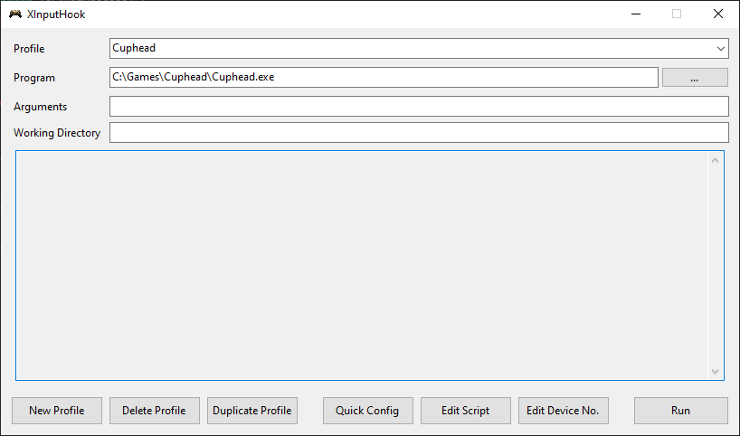
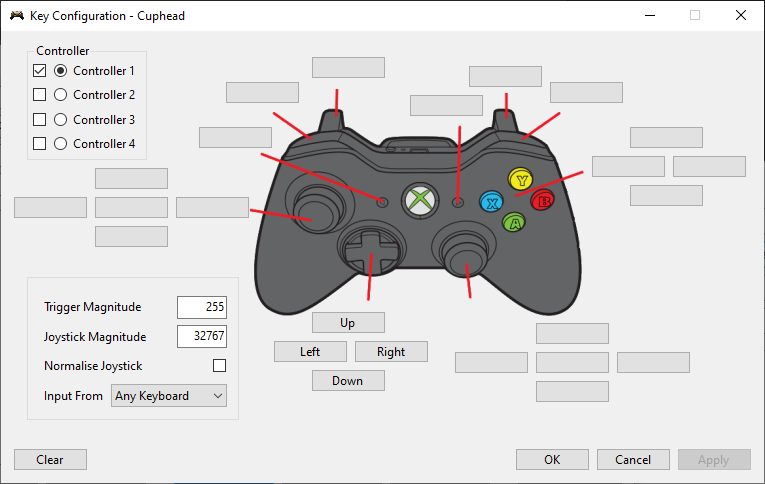
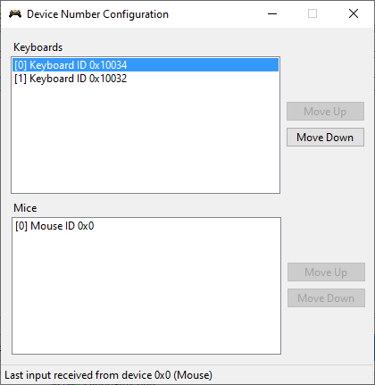

# XInputHook

XInputHook can intercept XInput function calls and modify functions to return custom data. This allows us to trick processes into thinking that an Xbox controller is connected and allows us to send arbitrary inputs. XInputHook works on a per-process basis and does not affect other unhooked processes or modify any executable files on disk.

XInputHook provides a simple GUI to map keyboard inputs to controller inputs but also includes optional Lua scripting for more advanced configurations.



# Limitations

XInputHook can silence keyboard keys that you map so that the hooked process will not see both the keyboard input and the controller input. However, **silenced keys apply to all keyboards**. Silencing keys is automatically done when using the [Quick Configuration](#quick-configuration) editor. Lua scripts should call [mutekey](#void-mutekeyint-key) to silence keys.

# Quick Configuration

Features

- Map keyboard keys to controller buttons.
- Separate configuration for up to 4 controllers.
- Enable or disable individual controllers.
- Customise joystick and trigger values.
- Optionally normalise joystick X and Y values to the joystick magnitude.
- Choose which keyboard to accept inputs from (see [Device Numbers](#device-numbers)).

**Note: this editor with generate a Lua script and will overwrite the script used for this profile**. If you have custom changes that you want to keep, backup the script before pressing OK or apply. The editor will detect this and warn you.



# Device Numbers

You may wish to use multiple keyboards (or mice) with overlapping inputs for multiple controllers. For example, two people might want to use the WASD keys but on different keyboards.

To distinguish devices, each keyboard and mouse has a unique HDEVICE ID. Unfortunately, these IDs do not persist when you replug the device or restart your computer so it is difficult to remember which device is which.

Therefore, you can use the device number editor to associate HDEVICE IDs with more convenient indices which are referred to as the _device number_.
The devices numbers available are `Keyboard 0`, `Keyboard 1`, `Keyboard 2`, `Keyboard 3` (the [mouse counterparts](#device-numbers-1) are also available in Lua scripting).

To find your device, press a keyboard key or mouse button and see the HDEVICE ID shown at the bottom. Since HDEVICE IDs do not persist, you will have to reconfigure device numbers each time you open XInputHook or plug in a new device. Configuring device numbers is only needed if you wish to use overlapping inputs for multiple controllers.



# Lua API

Familiarity with C and the Windows API is recommended.

## `void oninput(table rawinput)`

Parameters

- `table rawinput` A table representing a [RAWINPUT](https://learn.microsoft.com/en-us/windows/win32/api/winuser/ns-winuser-rawinput) struct.

You must implement this function. This function is called when an input event occurs and provides an opportunity to update the controller state. This function is called whenever any window receives a [WM_INPUT](https://learn.microsoft.com/en-us/windows/win32/inputdev/wm-input) event.

## `void setstate(int index, table? state)`

Parameters

- `int index` The index of the controller (0 <= index <= 3).
- `table? state` A table representing a [XINPUT_STATE](https://learn.microsoft.com/en-us/windows/win32/api/xinput/ns-xinput-xinput_state) struct or nil for a disconnected controller state. Missing fields in state.Gamepad are assumed to be zero.

Set the controller state to be reported to the hooked process.

## `void mutekey(int key)`

Parameters

- `int key` The key to mute as a [virtual key code](#virtual-key-codes). You may pass 0 to this function.

Silence a key from the [WM_KEYDOWN](https://learn.microsoft.com/en-us/windows/win32/inputdev/wm-keydown), [WM_KEYUP](https://learn.microsoft.com/en-us/windows/win32/inputdev/wm-keydown), [GetAsyncKeyState](https://learn.microsoft.com/en-us/windows/win32/api/winuser/nf-winuser-getasynckeystate), and [GetKeyState](https://learn.microsoft.com/en-us/windows/win32/api/winuser/nf-winuser-getkeystate) APIs.

## `int devicenumber(int hdevice)`

Parameters

- `int hdevice` The HDEVICE ID.

Return value

- `int` the device number or 0 if unknown. A valid device number will never be 0.

Get the device number from a HDEVICE ID. This function is used with rawinput.header.hDevice from [oninput](#void-oninputtable-rawinput).

## `void print(...)`

Parameters

- `...` The arguments to print.

This is the usual print function redirected to the XInputHook GUI window.

## Constants

### Device numbers

```
DEVICE_KEYBOARD_0
DEVICE_KEYBOARD_1
DEVICE_KEYBOARD_2
DEVICE_KEYBOARD_3
DEVICE_MOUSE_0
DEVICE_MOUSE_1
DEVICE_MOUSE_2
DEVICE_MOUSE_3
```

### RAWINPUT device types

<https://learn.microsoft.com/en-us/windows/win32/api/winuser/ns-winuser-rawinputheader>

```
RIM_TYPEMOUSE
RIM_TYPEKEYBOARD
RIM_TYPEHID
```

### RAWINPUT keyboard flags

<https://learn.microsoft.com/en-us/windows/win32/api/winuser/ns-winuser-rawkeyboard>

```
RI_KEY_MAKE
RI_KEY_BREAK
RI_KEY_E0
RI_KEY_E1
```

### RAWINPUT mouse flags

<https://learn.microsoft.com/en-us/windows/win32/api/winuser/ns-winuser-rawmouse>

```
MOUSE_MOVE_RELATIVE
MOUSE_MOVE_ABSOLUTE
MOUSE_VIRTUAL_DESKTOP
MOUSE_ATTRIBUTES_CHANGED
MOUSE_MOVE_NOCOALESCE
```

### RAWINPUT mouse button flags

<https://learn.microsoft.com/en-us/windows/win32/api/winuser/ns-winuser-rawmouse>

```
RI_MOUSE_BUTTON_1_DOWN
RI_MOUSE_LEFT_BUTTON_DOWN
RI_MOUSE_BUTTON_1_UP
RI_MOUSE_LEFT_BUTTON_UP
RI_MOUSE_BUTTON_2_DOWN
RI_MOUSE_RIGHT_BUTTON_DOWN
RI_MOUSE_BUTTON_2_UP
RI_MOUSE_RIGHT_BUTTON_UP
RI_MOUSE_BUTTON_3_DOWN
RI_MOUSE_MIDDLE_BUTTON_DOWN
RI_MOUSE_BUTTON_3_UP
RI_MOUSE_MIDDLE_BUTTON_UP
RI_MOUSE_BUTTON_4_DOWN
RI_MOUSE_BUTTON_4_UP
RI_MOUSE_BUTTON_5_DOWN
RI_MOUSE_BUTTON_5_UP
RI_MOUSE_WHEEL
RI_MOUSE_HWHEEL
```

### XINPUT_GAMEPAD buttons

<https://learn.microsoft.com/en-us/windows/win32/api/xinput/ns-xinput-xinput_gamepad>

```
XINPUT_GAMEPAD_DPAD_UP
XINPUT_GAMEPAD_DPAD_DOWN
XINPUT_GAMEPAD_DPAD_LEFT
XINPUT_GAMEPAD_DPAD_RIGHT
XINPUT_GAMEPAD_START
XINPUT_GAMEPAD_BACK
XINPUT_GAMEPAD_LEFT_THUMB
XINPUT_GAMEPAD_RIGHT_THUMB
XINPUT_GAMEPAD_LEFT_SHOULDER
XINPUT_GAMEPAD_RIGHT_SHOULDER
XINPUT_GAMEPAD_A
XINPUT_GAMEPAD_B
XINPUT_GAMEPAD_X
XINPUT_GAMEPAD_Y
```

### Virtual key codes

<https://learn.microsoft.com/en-us/windows/win32/inputdev/virtual-key-codes>

For character and number keys use `string.byte("W")` or `string.byte("7")` etc. to obtain the ASCII value.

```
VK_LBUTTON
VK_RBUTTON
VK_CANCEL
VK_MBUTTON
VK_XBUTTON1
VK_XBUTTON2
VK_BACK
VK_TAB
VK_CLEAR
VK_RETURN
VK_SHIFT
VK_CONTROL
VK_MENU
VK_PAUSE
VK_CAPITAL
VK_KANA
VK_HANGUL
VK_IME_ON
VK_JUNJA
VK_FINAL
VK_HANJA
VK_KANJI
VK_IME_OFF
VK_ESCAPE
VK_CONVERT
VK_NONCONVERT
VK_ACCEPT
VK_MODECHANGE
VK_SPACE
VK_PRIOR
VK_NEXT
VK_END
VK_HOME
VK_LEFT
VK_UP
VK_RIGHT
VK_DOWN
VK_SELECT
VK_PRINT
VK_EXECUTE
VK_SNAPSHOT
VK_INSERT
VK_DELETE
VK_HELP
VK_LWIN
VK_RWIN
VK_APPS
VK_SLEEP
VK_NUMPAD0
VK_NUMPAD1
VK_NUMPAD2
VK_NUMPAD3
VK_NUMPAD4
VK_NUMPAD5
VK_NUMPAD6
VK_NUMPAD7
VK_NUMPAD8
VK_NUMPAD9
VK_MULTIPLY
VK_ADD
VK_SEPARATOR
VK_SUBTRACT
VK_DECIMAL
VK_DIVIDE
VK_F1
VK_F2
VK_F3
VK_F4
VK_F5
VK_F6
VK_F7
VK_F8
VK_F9
VK_F10
VK_F11
VK_F12
VK_F13
VK_F14
VK_F15
VK_F16
VK_F17
VK_F18
VK_F19
VK_F20
VK_F21
VK_F22
VK_F23
VK_F24
VK_NUMLOCK
VK_SCROLL
VK_LSHIFT
VK_RSHIFT
VK_LCONTROL
VK_RCONTROL
VK_LMENU
VK_RMENU
VK_BROWSER_BACK
VK_BROWSER_FORWARD
VK_BROWSER_REFRESH
VK_BROWSER_STOP
VK_BROWSER_SEARCH
VK_BROWSER_FAVORITES
VK_BROWSER_HOME
VK_VOLUME_MUTE
VK_VOLUME_DOWN
VK_VOLUME_UP
VK_MEDIA_NEXT_TRACK
VK_MEDIA_PREV_TRACK
VK_MEDIA_STOP
VK_MEDIA_PLAY_PAUSE
VK_LAUNCH_MAIL
VK_LAUNCH_MEDIA_SELECT
VK_LAUNCH_APP1
VK_LAUNCH_APP2
VK_OEM_1
VK_OEM_PLUS
VK_OEM_COMMA
VK_OEM_MINUS
VK_OEM_PERIOD
VK_OEM_2
VK_OEM_3
VK_OEM_4
VK_OEM_5
VK_OEM_6
VK_OEM_7
VK_OEM_8
VK_OEM_102
VK_PROCESSKEY
VK_PACKET
VK_ATTN
VK_CRSEL
VK_EXSEL
VK_EREOF
VK_PLAY
VK_ZOOM
VK_NONAME
VK_PA1
VK_OEM_CLEAR
```

# Building

- Open the solution in Visual Studio 2022.
- Batch build both the x86 and x64 architectures of the dll projects (DetoursWrapper and Injectee). Alternatively, just build everything.
- Build XInputHook in any architecture you want.
- See output in the `build` folder.
